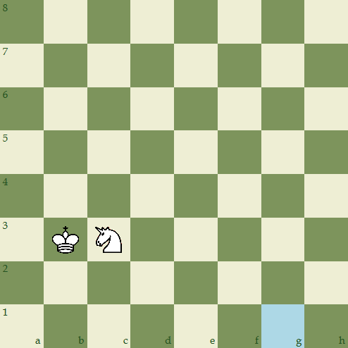
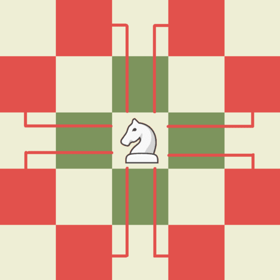

# Chess Puzzle
Consider the chess state below:

The goal of the game is to move the king or the knight piece to the square g1 (marked with light blue). The pieces move according to the rules of chess, with the following extra constraint: a piece can be moved if and only if it is on a square that is under attack by the other piece.

## Moves of the pieces:

- The king moves one square in any direction.

 
- The knight moves in an L-shape: two squares in one direction and then one square in a direction perpendicular to the first direction.

## States of the pieces:

 

## Instructions for optimal solution:
**Initial Positions:**
    - King: b3
    - Knight: b3

- **Moves:**
1. Knight moves from c3 to a2
2. Knight moves from  a2 to c1
3. King moves from b3 to c2
4. Knight moves from c1 to b3
5. Knight moves from b3 to d4
6. King moves from c2 to d3
7. Knight moves from d4 to e2
8. Knight moves from e2 to g1

### Final Positions:
- King: d3
- Knight: g1

## Technical Implementation

- **Ordinal Image Storage**: Manages chess piece images based on ordinal positions.
- **Results Storage**: Saves game results in JSON format using [Jackson](https://github.com/FasterXML/jackson).
- **Logging**: Records events and errors using [TinyLog](https://tinylog.org/v2/).
- **Breadth First Search**: Finds the optimal solution using BFS algorithm.
- **JavaFX**: Implements GUI using JavaFX library.

This project was built as a part of the Software Engineering course at the University of Debrecen.
